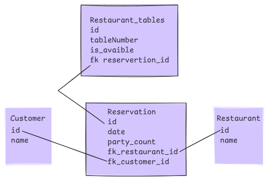
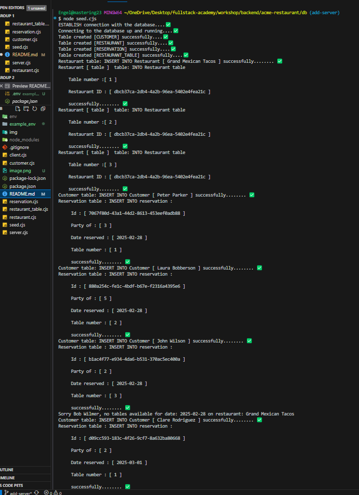

# The Acme Restaurant
   build a Restaurant RESTful API that calls exported methods from another file.
   Acme Restaurant Reservation API
The Acme Restaurant Reservation API allows customers to book reservations based on the availability of tables. The restaurant has 30 tables, and customers can choose from the available ones. The API supports functionalities such as:

Checking table availability: Customers can see which tables are free before booking.
Making a reservation: Customers can select an available table and reserve it.
Modifying or canceling a reservation: Customers can update or cancel their reservation if needed.
The system ensures that no more than 30 tables are reserved at a time, providing an organized and efficient way to manage reservations at Acme.
   

```
            |--------|
            |DATABASE|
            |--------|
  Customer
  id (UUID)
  name (STRING)
----------------
  Restaurant
  id (UUID)
  name (STRING)
------------------
  Reservation
  id (UUID)
  date (DATE NOT NULL)
  party_count (INTEGER NOT NULL)
  restaurant_id (UUID REFERENCES restaurants table NOT NULL)
  customer_id (UUID REFERENCES customer_table NOT NULL)
  -----------------------
  restaurant_table
  id(uuID)
  table INTEGER NOT NULL , // 1 TO 30 TABLES
  is_avaible  Boolean  
  reservertation_id (UUID REFERENCES reservation table NOT NULL)
  ```
  Example Result Restaurant_table

